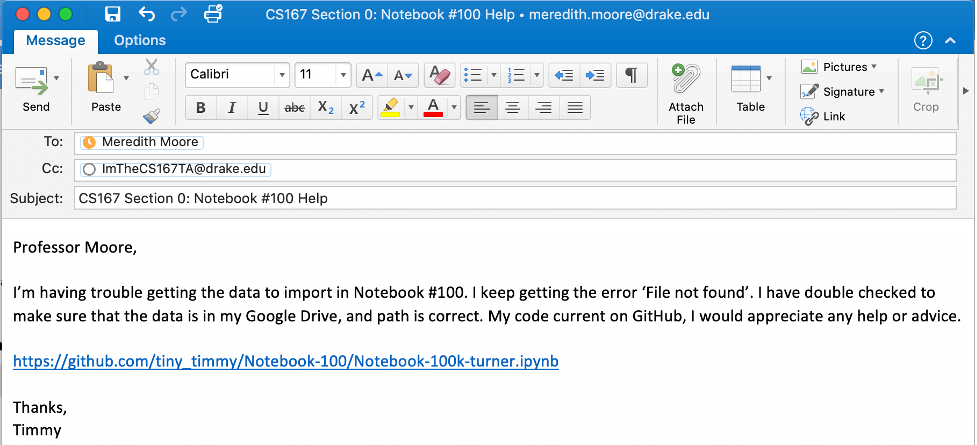

# ✉️ Email Tips 

Here are a few tips to make our communication as efficient as possible this semester.

## 1. Who:
Let's start by the **who** to send it to. If you are looking for help debugging your code, make sure you not only send it to [Professor Moore](mailto:meredith.moore@drake.edu), 
but that you also CC the TA (the TA is currently TBD, and I will update it with their information once they are assigned). This increases your chances of getting a 
quick response to your question. 

## 2. What: 
A successful email to the professor, specifcially an email that is looking for help debugging some code should have a few components:
- **Descriptive Subject**: Start off with a Subject line that is descriptive. Include the Course Number (CS167), your Section Number (0 or 1), and the assignment that you are having trouble with.
- **Problem**: Include a concise description of the problem 
- **The Error**: What's gone wrong? Is there an error? If so, be sure to include the error. Make sure it's easy to understand where you got stuck.
- **Things you've tried**: Include a description of what you've tried to get past this problem so far. Not sure where to start? Check out these [debugging tips](/debugging_tips/).
- **Link to Your Updated Code**: This one is important. Be sure to push (save) your most recent code to GitHub, and include the link to your GitHub repository in your email. 

## 3. When:
While the Instructor and TAs will do their best to respond to your questions quickly and efficiently, the closer to the deadline that you ask the question, 
the less likely there will be time for us to answer your question before the deadline. Get started on your assignments early, and be sure to ask questions early and often.

# Examples:

## What _not_ to do:
Here is an example of an email that is not very helpful. See if you can spot what Timmy did wrong:

## What to do:
Here is an example of an email that includes all of the above. 

